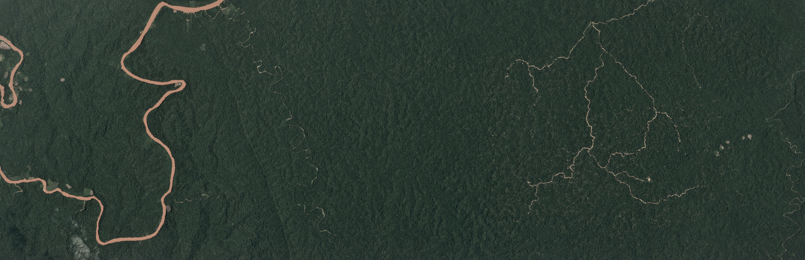
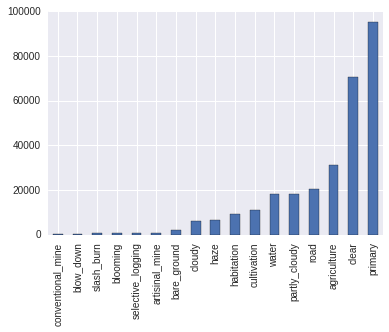
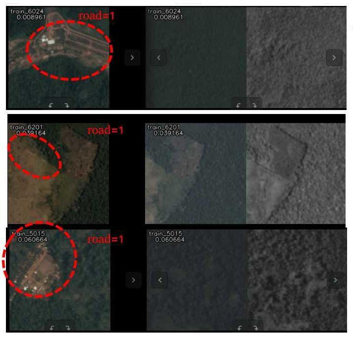

# Predicting Land Use in the Amazon using Deep Learning
By Annie Zhao and Lewis Fishgold

## The Planet Kaggle Contest

Source: <a href="https://www.kaggle.com/c/planet-understanding-the-amazon-from-space/data">Planet</a>

This past summer, [Planet](http://www.planet.com) launched the [Understanding the Amazon from Space](https://www.kaggle.com/c/planet-understanding-the-amazon-from-space)  Kaggle competition. They provided over 100,000 chips extracted from large images taken by a flock of satellites over the Amazon basin in 2016. The 40,000 training and 60,000 testing chips were given in both 3-band RGB JPEG and four band IR-RBG TIFF formats. Using crowd-sourced labor, each training chip was assigned a set of ground truth labels indicating the types of land use appearing in the chip. The goal of the contest was to implement a classifier to predict the set of labels for each of the testing chips. The quality of the predictions was measured using the F2 score, which is a weighted average of precision and recall, with greater emphasis on recall.

For the Amazon images, there were 17 possible labels, which could be broadly split into three categories.

1. **atmospheric labels**: clear, partly cloudy, cloudy and hazy
2. **common labels**: primary, water, habitation, agriculture, road, cultivation and bare ground
3. **rare labels**: artisinal mine, blooming, blow down, conventional mine, selective logging and slash burn.

At Azavea, we have been using deep learning to analyze satellite and aerial imagery as part of the [Raster Vision](https://github.com/azavea/raster-vision) project. In a previous [blog post](https://www.azavea.com/blog/2017/05/30/deep-learning-on-aerial-imagery/), we discussed our work on semantic segmentation. This contest provided us with a challenging opportunity to extend our capabilities and experiment with multi-label image classification.

### Dataset Challenges

#### Ambiguous and Rare Labels

Ideally, the criteria for assigning a label are clear and distinct, and consensus about the ground truth labeling is easily attained. Unfortunately, the Planet dataset has many ambiguous labels which are difficult even for people to assign.

In addition, the labels in this dataset were quite varied in frequency. The `primary` label was by far the most common, appearing in around 40,000 of the provided chips. On the other hand, rare labels like `conventional mining` and `blow down` only appeared a few hundred times each. With so few examples of the rare labels, it was hard to make accurate predictions.

Source: <a href="https://github.com/planetlabs/planet-amazon-deforestation/blob/master/planet_chip_examples.ipynb">anokas</a>

#### Inability to utilize infrared channel

Although initial experiments with the JPEG images yielded decent results, the JPEG images are limited in that they only contain RGB channels, i.e. human-visible bands of light.
The additional infrared band contained in the TIFF images is commonly used to calculate amounts of vegetation (NDVI) or water (NDWI) within an image.
As the Amazon has significant amounts of both vegetation and water, we expected that the infrared band would contain valuable information that would improve the performance of our models.

However, after conducting a series of experiments using TIFF chips we found that the results drastically underperformed the same models trained using JPEG chips. After inspecting the images, we found that many of the TIFF chips are mislabeled. We suspect this is because the TIFF and JPEG chips were often misaligned, and the labeling was based on the JPEG version.

In many cases, the chips were slightly misaligned between the two versions. This misalignment didn't generally impact the correctness of the provided ground truth label but in rare cases, would render a label incorrect for one version of the chip. For example, cropping the leftmost 10% of an image might remove a river from the chip and therefore make the `water` label incorrect for that chip.

In a smaller portion of the TIFF and JPEG chips were blatantly dissimilar.
In the figure below, the left hand column displays the JPEG chip, while the right hand columns display the TIFF chip under two different visualizations. Each row was labeled with `road`, but in the first and third rows, we can see that the TIFF chips were taken at some other time or location and do not contain a road.

source: <a href="https://www.kaggle.com/c/planet-understanding-the-amazon-from-space/discussion/32453">Heng CherKeng</a>

## Our Approach

Deep learning models for performing object recognition compute a probability distribution over labels, and then predict the label that is most likely. In contrast, our goal was to do multi-label classification, to predict a set of labels for each image. This can be done by computing a probability distribution for each individual label, and then predicting all labels whose probabilities are above a threshold. Our general approach to this problem was to take a successful object recognition model ([ResNet50](https://arxiv.org/abs/1512.03385)), and modify it for the task of multi-label classification. To do this, we only needed to change the final activation and loss functions.
In particular, we switched from using a softmax to a sigmoid activation function, and from a categorical cross entropy to a binary cross entropy loss function.

As is standard practice, we fine-tuned a model pre-trained on the Imagenet dataset in order to leverage what was learned on a prior, related task and thereby speed up training. Since satellite images do not have a canonical orientation, we were able to augment our training set using 90 degree rotations and vertical flips, in addition to the horizontal flips that are commonly used . To optimize models, we mainly used the Adam optimizer with an initial learning rate of 10e-3 and divided the learning rate by 10 at the 1/3rd and 2/3rd mark.

The F2 score, which favors recall, is not differentiable, so we were unable to use it directly as the loss function. Instead, we trained the model using binary cross entropy (which optimizes for accuracy, in a sense), and then optimized the decision thresholds in order to maximize the F2 score. The decision thresholds determine how high the probability needs to be for each label to be predicted, and we used coordinate ascent to optimize the F2 score with respect to each decision threshold.

To eke out a little bit more performance, we made predictions using an ensemble of models. An ensemble is a set of models, whose individual predictions are combined together by voting or averaging. By exploiting the "wisdom of crowds," a diverse ensemble can make more accurate predictions than a single model. Therefore, we combined five [ResNet50](https://arxiv.org/abs/1512.03385), five [DenseNet121](https://arxiv.org/abs/1608.06993), and five [Inception v3](https://arxiv.org/abs/1512.00567) models using majority voting.

## Results

We placed 23rd overall out of nearly a thousand teams with a private leaderboard F2 score of 0.93154. The winning Kaggler, `bestfitting`, obtained a score of 0.93318, and a discussion of his approach can be found in his [solution summary](http://blog.kaggle.com/2017/10/17/planet-understanding-the-amazon-from-space-1st-place-winners-interview/).

For a more qualitative look at our results, here are some chips with labels predicted by our best single-model network. In this figure, the ground truth labels (ie. assigned by humans) for the Planet Kaggle dataset are bolded. Green bolded labels are correct. Unbolded and uncolored labels are false positives that have been incorrectly predicted for the chip. Red bolded labels are false negatives and are incorrectly missing from the predictions.

Source: <a href="https://github.com/azavea/raster-vision/">Raster Vision</a>

## Discussion

As is often the case when developing machine learning models, many of the ideas we tried did not improve the score. Here are some of our unsuccessful attempts.
* Training a separate network to predict the atmospheric labels using a softmax activation function to exploit the fact that only one atmospheric label can be valid for an image.
* Training a separate network with more regularization for images with rare labels.
* Using more aggressive lossy transformations such as non-90 degree rotations and scaling.
* Oversampling images with rare labels.
* Deciding whether to use the TIFF or JPEG version of a chip by predicting how misaligned they were.

Sometimes it takes a clever idea or an unorthodox breakthrough to push the accuracy of a predictive model past all its competitors, but in this particular competition, approaches using relatively standard techniques worked very well.

By participating in this Kaggle competition, we gained access to an interesting dataset and got a sense of how well our code works. On the other hand, in some ways the incentives provided by the contest were misaligned with our own.  Kaggle competitions are often won by very slim margins, which often rewards complex ideas that are difficult to implement, and add a negligible amount of performance. In contrast, our preference is for simpler, more scalable approaches.

Furthermore, this contest used a scoring metric which effectively hid performance on the rare labels which we were more interested in. The contest score was computed by taking the F2 score for each sample, and then averaging over them. Because most of the samples had the easy to classify `primary` label, the final score was dominated by performance on this label. To examine how well we did on individual labels, we computed a per-label F2 scores on a validation dataset. When computing the score this way, we found that the average F2 score for the rare labels was 0.48, much lower than our contest score of 0.93.

Now that the competition is over, we have switched focus to the tasks of object detection and counting, and integrating computer vision into [Raster Foundry](https://www.rasterfoundry.com/), an Azavea product which supports the  storage, analysis, and visualization of aerial and satellite imagery.
