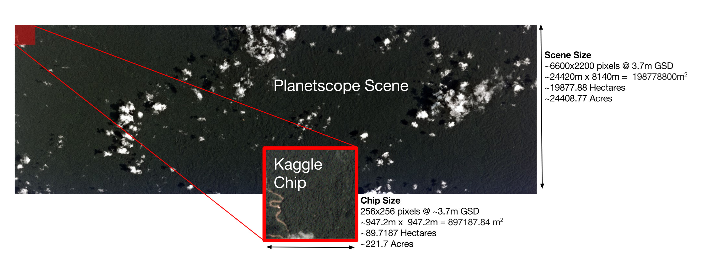
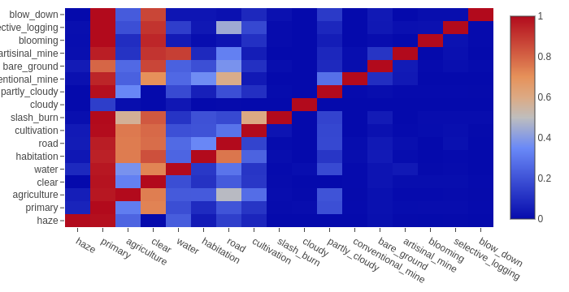
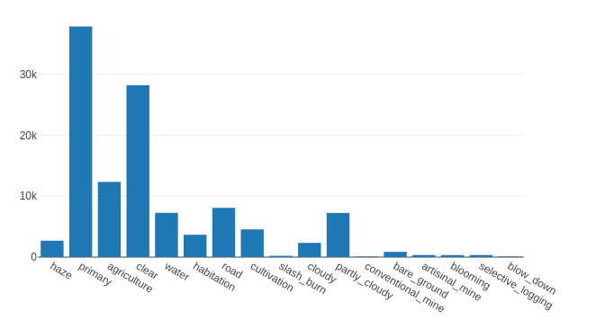

## Scene Tagging and the Planet Kaggle Competition

### The Task

This past summer, Planet launched the *Understanding the Amazon from Space* Kaggle competition. We participated in this competition using Raster Vision, a system for analyzing aerial and satellite imagery using deep learning. Raster Vision works across several different tasks, including semantic segmentation, object detection and scene tagging as well as a range of datasets. The varied data within the Amazon competition gave us a challenging opportunity to make a robust scene tagging functionality.

Planet provided over 100,000 chips from large images taken by a flock of satellites over the Amazon basin in 2016. These 40,000 train and 60,000 test chips were given in both 3-band RGB JPEG and four band IR-RBG TIFF formats. The goal of tagging is to infer a set of labels for a given chip. For the Amazon images, there were 17 possible tags, broadly split into three categories.

1) atmospheric labels: clear, partly cloudy, cloudy and hazy
2) common labels: primary, water, habitation, agriculture, road, cultivation and bare ground
3) rare labels: artisinal mine, blooming, blow down, conventional mine, selective logging and slash burn.

source: <a href="https://www.kaggle.com/c/planet-understanding-the-amazon-from-space/data">Planet</a>

The tags were quite varied in frequency. Primary was by far the most common tag for an image and often appeared alongside the X and Y tags. Rare labels, on the other hand, were a source of concern. There were so few samples of certain rare labels that after splitting a portion of training data into a validation hold-out set, it was possible to have less than 100 data points for some rare tag versus the thousands of examples of images containing primary rainforest. Without somehow focusing our models on paying more attention to rarer labels, those anomalous features could easily be washed away.

source: <a href="https://www.kaggle.com/anokas/data-exploration-analysis">anokas</a>

### Immediate Plan of Attack

-briefly, data generation/pre and post processing techniques
-the purpose of rastervision with usage of conv neural nets + ensembling
-avoiding overfitting

### Misconfigured Labels

Each of the chips were labeled with ground truth tags through crowd-sourced labor. The ground truth could then be used to teach models the correct labels.  In order for this task to perform accurately, it is crucial that the ground truth be actually truthful. In an ideal world, the criteria for a label is clear and distinct to humans and similarly obvious to trained neural networks. Unfortunately, Planet's dataset had noticeable amounts of ambiguous and, even worse, clearly incorrect labels. For example, we can see that the network often mistakes when to label a chip with the tag `agriculture`. However, if we examine the ground truth tags for each chip, it's not obvious that the human classifications are correct either.

When we examined the data further, there was far more reason to be alarmed than simple human error.

The resulting noise proved to be a major challenge in producing accurate results with even our most complex models using either TIFF or JPEG files.

### Issues with Misconfigured Labels on .tif vs .jpg

-discuss problem of ambiguous/inconsistent labeling
-variation between tif and jpg, therefore unavailability of IR band
	-can discuss prior success with IRRG here

Here are some examples of training chips with labels predicted by our best single-model network.

In the above figure, the ground truth tags (ie. tagged by hand) for the Planet Kaggle dataset are bolded. Green bolded tags are correct. Unbolded and uncolored tags mean that they have been incorrectly predicted for the chip. Red bolded tags are ones missed by the network prediction.

In this competition, we placed 23nd overall out of nearly a thousand teams with a private leaderboard prediction accuracy of 93.154% using the following techniques.

The winning Kaggler, bestfitting, obtained a score of 93.318% accuracy with their solution.

More details on this approach can be found in bestfitting's [solution summary](https://www.kaggle.com/c/planet-understanding-the-amazon-from-space/discussion/36809).

* [DenseNet121](https://arxiv.org/abs/1608.06993)

-single model: DenseNet121 with cyclic?
-multiple model: prediction majority vote over 5x5x5x (incep, resnet, dense)?

show scores of the winner, talk a bit about dehazing, don't know how much it helps

#### Other model architectures
* [ResNet50](https://arxiv.org/abs/1512.03385)
* [Inception v3](https://arxiv.org/abs/1512.00567)
* [DenseNet121](https://arxiv.org/abs/1608.06993)
* [DenseNet169](https://arxiv.org/abs/1608.06993)
-resnet50 (good tester network)
-fcn
-wrn
-test-time/image time augmentation
-image zooming (lossless vs lossy transformations)
-talk a bit about how these models differ

-creating separate networks for softmax versus sigmoid, one hot labeling
-boosting presence of rarer labels

-identifying best optimizer:
	-sgd? Adam? cyclic? Yellowfin?
	- is hand tuning worth

Kaggle competitions are often won by very slim margins. In the case of the Amazon rainforest data, we spent a significant amount of development time trialing different methods of preprocessing and postprocessing the images .

Beating random predictor

### Discussion

-f2 score didn't incentivize the right behavior
-some competitions are won by clever ideas but simple, vanilla was just the best
-5 points of we tried this method --> and this was the score relationship
		- create a graphic describing this

### Future Work

The repository for Raster Vision can be found [here](https://github.com/azavea/raster-vision/) and is open to the public.

Nature of kaggle competitions, improving results against private leaderboard means not overfitting/aka generalization results through creating many models, identifying accurate but disjoint predictions and then averaging these results together.
